<div align="center">

<div class="logo">
</div>

<h1>From Understanding to Erasing: Towards Complete and Stable Video Object Removal</h1>


<div>
    <a href='' target='_blank'>Dingming Liu<sup>1</sup></a>&emsp;
    <a href='' target='_blank'>Wenjing Wang<sup>2</sup></a>&emsp;
    <a href='' target='_blank'>Chen Li<sup>2</sup></a>&emsp;    
    <a href='' target='_blank'>Jing LYU<sup>2</sup></a>&emsp;  
</div>
<div>
    <sup>1</sup>Peking University&emsp; 
    <sup>2</sup>WeChat Vision, Tencent Inc.&emsp; 
</div>

<!-- <div>
    <h4 align="center">
        <a href="https://arxiv.org/abs/2508.18633"></a>
    </h4>
</div> -->


---

</div>

  
## Results

<table>
  <thead>
    <tr>
      <th>Video&amp;Mask</th>
      <th>Output</th>
    </tr>
  </thead>
  <tbody>
    <tr>
      <td>
        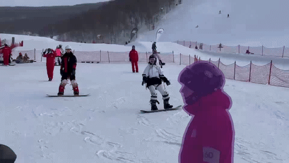
      </td>
      <td>
        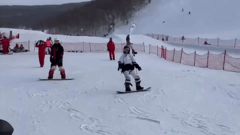
      </td>
    </tr>
    <tr>
      <td>
        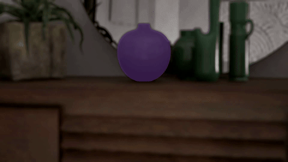
      </td>
      <td>
        
      </td>
    </tr>
    <tr>
      <td>
        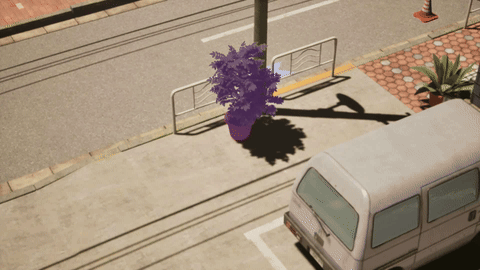
      </td>
      <td>
        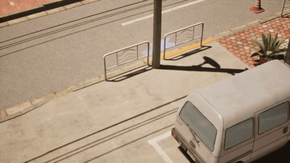
      </td>
    </tr>
    <tr>
      <td>
        
      </td>
      <td>
        
      </td>
    </tr>
    <tr>
      <td>
        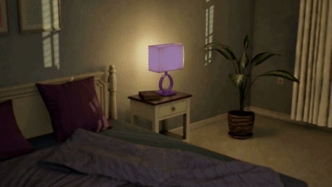
      </td>
      <td>
        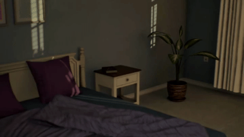
      </td>
    </tr>
    <tr>
      <td>
        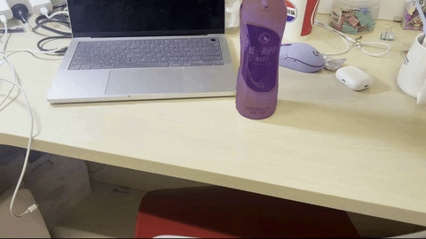
      </td>
      <td>
        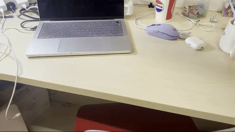
      </td>
    </tr>
    <tr>
      <td>
        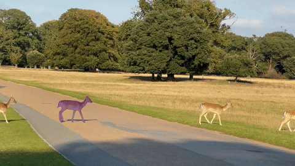
      </td>
      <td>
        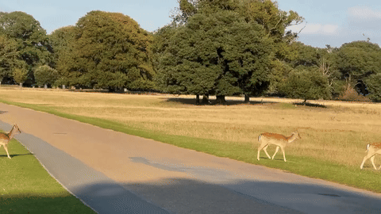
      </td>
    </tr>
    <tr>
      <td>
        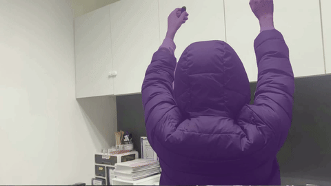
      </td>
      <td>
        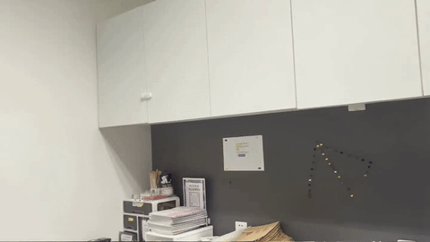
      </td>
    </tr>
    <tr>
      <td>
        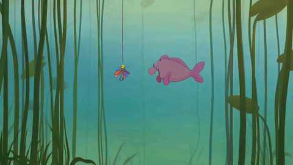
      </td>
      <td>
        
      </td>
    </tr>
  </tbody>
</table>


## Dependencies

Create Conda Environment and Install Dependencies

   ```bash
   # create new anaconda env
   conda create -n undereraser python=3.12 -y
   conda activate undereraser

   # install python dependencies
   pip3 install -r requirements.txt
   ```


## Get Started
### Pre-trained models
Download the weights from this [`link`](https://drive.google.com/drive/folders/1R3DqCmYJ_NqCjl2I8iU4H0WM2C2PWMca?usp=drive_link). Put the two files under the folder [`weight`](./weight). 


We use pretrained [`Wan2.1-Fun-V1.1-14B-InP`](https://huggingface.co/alibaba-pai/Wan2.1-Fun-V1.1-14B-InP) as our base model. 
You can download the Wan2.1-Fun-1.3B-InP base model from this [`link`](https://huggingface.co/alibaba-pai/Wan2.1-Fun-V1.1-14B-InP). Put the whole folder under the folder [`models`](./models). 

The [`models`](./models) will be arranged like this:
```
models
 ├── Wan2.1-Fun-V1.1-14B-InP
   ├── google
     ├── umt5-xxl
       ├── spiece.model
           ...
   ├── xlm-roberta-large
     ├── sentencepiece.bpe.model
         ...
   ├── config.json
   ├── configuration.json
   ├── diffusion_pytorch_model.safetensors
   ├── models_clip_open-clip-xlm-roberta-large-vit-huge-14.pth
   ├── models_t5_umt5-xxl-enc-bf16.pth
   ├── Wan2.1_VAE.pth
```


### Inference
We provide some examples in the [`data`](./data) folder. 
Run the following commands to try it out:
```shell
python infer.py 
```
You can also prepare and test your own data following the same format.


### Dataset
The test datasets are available at this [`link`](https://drive.google.com/drive/folders/1tqBY5QxatE8FrE7NkXnIxOwJlIftUBN_?usp=drive_link), including our constructed Camera-Bench and Scene-Bench. 

### TODO
-  Release training code.


## Citation

   If you find our repo useful for your research, please consider citing our paper:

   ```bibtex
   @article{miao2025rose,
      title={From Understanding to Erasing: Towards Complete and Stable Video Object Removal}, 
      author={Liu, Dingming and Wang, Wenjing and Li, Chen and LYU, Jing},
      journal={arXiv preprint},
      year={2026}
}
   ```


## Acknowledgement

This code is based on [VideoX-Fun](https://github.com/aigc-apps/VideoX-Fun) and [LightX2V](https://github.com/ModelTC/LightX2V). Thanks for their awesome works！
